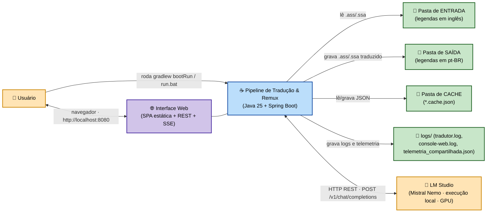
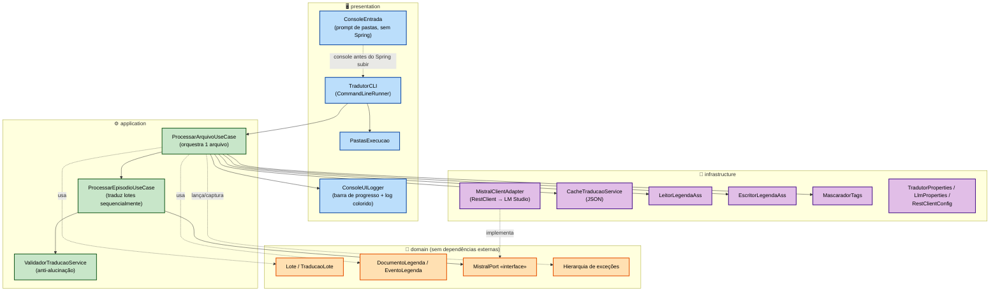
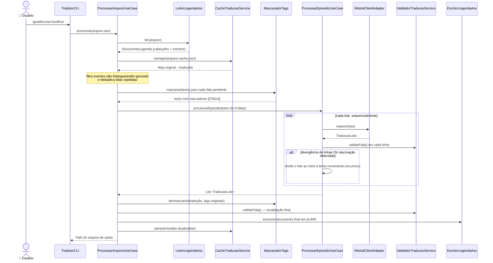
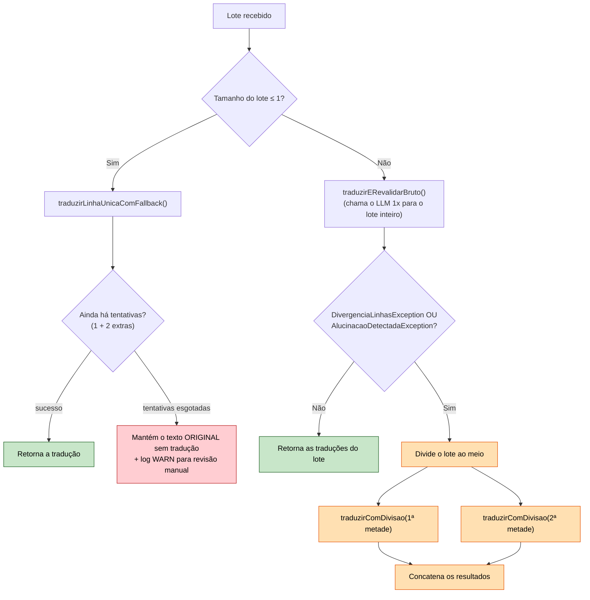
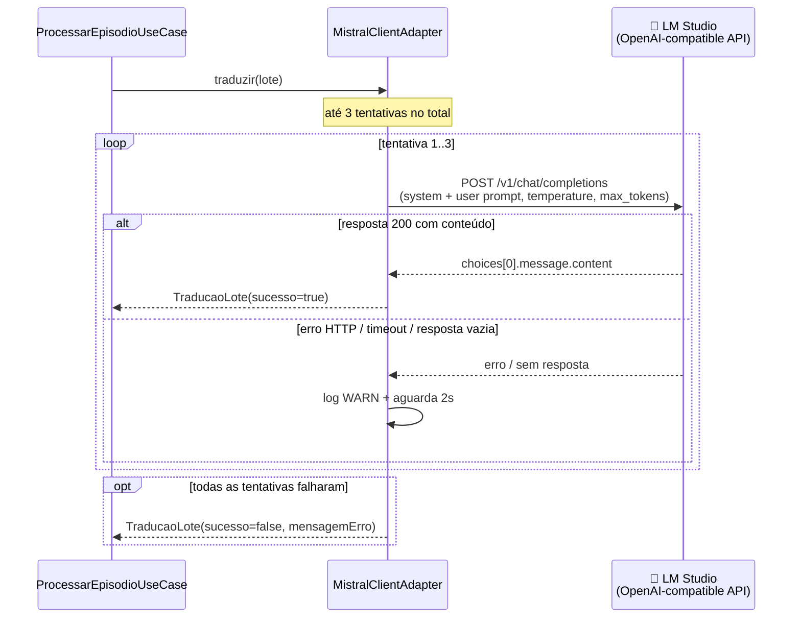
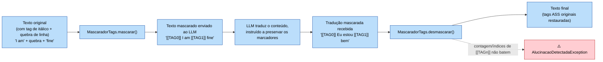
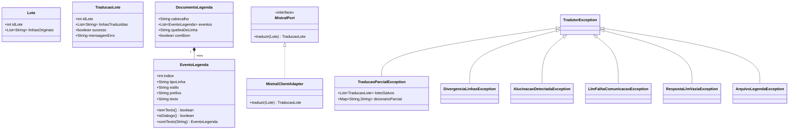
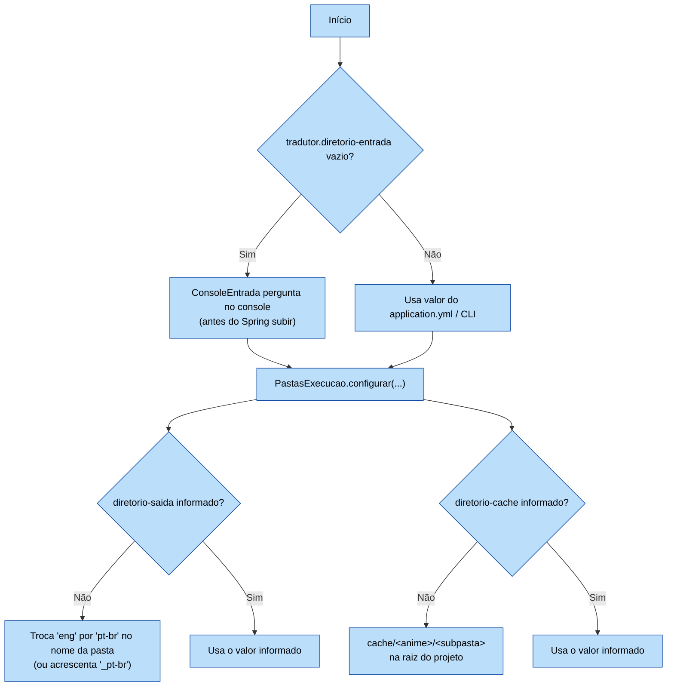

<div align="center">

# 🎌 Tradutor de Legendas de Anime — LLM Local

### Tradução automática de legendas `.ass` / `.ssa` (Inglês → Português-BR) usando um LLM rodando **100% local**, sem nuvem, sem custo por token e sem enviar suas legendas para terceiros.

[](https://openjdk.org/projects/jdk/25/)
[](https://spring.io/projects/spring-boot)
[](https://gradle.org)
[](#llm)
[](LICENSE)

[](#pre-requisitos)
[-8A2BE2?style=for-the-badge)](#arquitetura)
[](#decisoes)
[](https://github.com/carmipa/traducao_animes_llm_local_java/commits/main)

</div>

<p align="center">
  <a href="#sumario"><b>Sumário</b></a> •
  <a href="#visao-geral">Visão Geral</a> •
  <a href="#arquitetura">Arquitetura</a> •
  <a href="#instalacao">Como Executar</a> •
  <a href="#configuracao">Configuração</a> •
  <a href="ARQUITETURA.md"><b>📐 Documento de Arquitetura Completo</b></a> •
  <a href="LICENSE">📜 Licença</a>
</p>

---

<a id="sumario"></a>
## 📚 Sumário

1. [✨ Visão Geral](#visao-geral)
2. [🧩 Funcionalidades](#funcionalidades)
3. [🌐 Interface Web](#interface-web)
4. [🏗️ Arquitetura em Camadas](#arquitetura)
5. [🔄 Pipeline de Tradução — Visão Ponta a Ponta](#pipeline)
6. [✂️ Divisão Recursiva de Lotes (Anti-Alucinação)](#divisao-lotes)
7. [🔌 Integração com o LLM (Retry)](#llm)
8. [🏷️ Mascaramento de Tags ASS/SSA](#mascaramento)
9. [📦 Modelo de Domínio & Hierarquia de Exceções](#dominio)
10. [🗂️ Resolução Automática de Pastas](#pastas)
11. [✅ Pré-requisitos](#pre-requisitos)
12. [🚀 Instalação e Execução Rápida](#instalacao)
13. [⚙️ Configuração (`application.yml`)](#configuracao)
14. [🖥️ Exemplo de Uso (Console)](#exemplo-uso)
15. [📁 Estrutura de Pastas do Repositório](#estrutura-projeto)
16. [🧪 Testes](#testes)
17. [🐛 Solução de Problemas / JDK 25](#troubleshooting)
18. [🗺️ Histórico de Decisões](#decisoes)
19. [🤝 Contribuindo](#contribuindo)
20. [📜 Licença](#licenca)
21. [🙏 Créditos](#creditos)

---

<a id="visao-geral"></a>
## ✨ Visão Geral

Este projeto é uma aplicação **Java 25 + Spring Boot** que traduz legendas de anime no formato Advanced SubStation Alpha (`.ass`/`.ssa`) do **inglês para português do Brasil**, usando um **modelo de linguagem (LLM) executado localmente** — por padrão, **Mistral Nemo Instruct** servido pelo [LM Studio](https://lmstudio.ai/) através de uma API compatível com OpenAI (`/v1/chat/completions`).

> [!NOTE]
> O projeto é a refatoração para Java de um pipeline originalmente escrito em Python. A motivação da migração foi reduzir o overhead de I/O usando **Virtual Threads** da JVM onde isso faz sentido — embora, na prática, o gargalo real seja a **GPU única** do LLM local, e não a JVM (ver [Histórico de Decisões](#decisoes)).

> [!NOTE]
> Desde jun/2026 o ponto de entrada padrão é uma **interface web local** (sobe sozinha em `http://localhost:8080` e abre o navegador automaticamente) — os prompts de console antigos continuam funcionando, mas só se você passar `--tradutor.diretorio-entrada=...` explicitamente. Veja [🌐 Interface Web](#interface-web).

Diferenciais do projeto:



> [!IMPORTANT]
> Não há nenhuma chamada de rede externa além do `localhost` do LM Studio (e, opcionalmente, da correção via Google Translate — ver tabela de funcionalidades). A interface web só aceita conexões da própria máquina (`server.address: 127.0.0.1`) e não tem autenticação — não é pensada para ser exposta na rede.

---

<a id="funcionalidades"></a>
## 🧩 Funcionalidades

| Recurso | Descrição |
|---|---|
| 🧠 **Tradução 100% local** | Nenhuma dependência de API paga em nuvem; conversa apenas com `tradutor.llm.base-url` (LM Studio). |
| 💾 **Cache JSON reaproveitável** | Cada arquivo gera um `*.cache.json`. Correções manuais no JSON são **respeitadas** na próxima execução. |
| 🧹 **Deduplicação de falas** | Falas idênticas repetidas no episódio são traduzidas **uma única vez**. |
| 🏷️ **Mascaramento de tags ASS/SSA** | Tags de formatação (`{\i1}`, `{\pos(...)}`, `\N`, `\n`, `\h`) são protegidas antes de chegar ao LLM. |
| 🚨 **Validação anti-alucinação** | Detecta resíduo em inglês, preâmbulos do modelo e contagem de linhas divergente. |
| ✂️ **Divisão recursiva de lotes** | Um lote problemático é dividido ao meio recursivamente até isolar a fala culpada — não descarta o lote inteiro. |
| 🔁 **Retry automático** | Até 3 tentativas com pausa de 2s em falha HTTP/timeout/parse ao chamar o LLM. |
| 💔 **Tolerância a falha parcial** | Uma falha no meio do episódio salva no cache tudo que já foi traduzido (`TraducaoParcialException`). |
| 📊 **Barra de progresso estilo `tqdm`** | Via `me.tongfei:progressbar`, com mensagens coloridas sobre a barra (modo CLI). |
| 🪵 **Logging triplo** | Console colorido (ANSI) + `logs/tradutor.log` (estruturado, com `loteId` no MDC) + `logs/console-web.log` (transcrição do console da interface web). |
| 🌐 **Interface web local** | SPA com painéis para análise, extração, tradução, correção de cache, remuxer, mapa do projeto e telemetria — sobe automaticamente como modo padrão. Ver [🌐 Interface Web](#interface-web). |
| 🔒 **Web vinculada só ao próprio PC** | `server.address: 127.0.0.1` — sem autenticação, então o servidor não aceita conexões de outros dispositivos da rede. |
| 📡 **Logs ao vivo via SSE** | Cada painel da interface web recebe só os logs da sua própria operação (`GET /api/logs/stream`, um canal SSE por pipeline). |
| 📈 **Telemetria persistida no projeto** | `logs/telemetria_compartilhada.json` acumula métricas de análise de mídia e tradução entre execuções; consumido pelo painel "Telemetria" via `GET /api/telemetria`. |
| 🌐 **Par de idiomas configurável** | `idioma-original`/`idioma-traduzido` gravados no cache, prontos para outros pares além de en→pt-br. |

> [!WARNING]
> O **prompt de sistema** enviado ao LLM (`MistralClientAdapter.PROMPT_SISTEMA`) está atualmente fixado para a terminologia da série **DanMachi** ("Familia", "Dungeon", "Orario", "Bell Cranel", "Hestia"). Para traduzir outro anime com terminologia própria, ajuste manualmente essa constante antes de compilar — não há (ainda) uma propriedade de configuração para isso.

---

<a id="interface-web"></a>
## 🌐 Interface Web

Ao rodar `.\gradlew.bat bootRun` (ou `run.bat`) **sem nenhum argumento**, o programa sobe em modo `WEB`: levanta um Tomcat embutido em `http://localhost:8080`, abre o navegador padrão automaticamente e fica esperando ação na interface, em vez de pedir caminhos no console.

| Painel | O que faz | Endpoint acionado |
|---|---|---|
| Início | Resumo/atalhos do repositório (cards estáticos + contagem de cache) | — |
| 1. Análise de Mídia | Audita codecs, resolução e sincronia de legendas embutidas em vídeos | `POST /api/analisar` |
| 2. Extração | Extrai faixas de legenda (`ASS`/`PGS`/`SRT`) de arquivos `.mkv` | `POST /api/extrair` |
| 3. Tradução Local | Traduz `.ass`/`.ssa` via LLM local (mesmo pipeline do modo CLI) | `POST /api/traduzir` |
| 4. Correção Cache | Limpa falas com falha no cache, ou preenche via raspagem do Google Translate | `POST /api/corrigir-cache` / `POST /api/corrigir-scraping` |
| 5. Remuxer | Junta vídeo original + legenda traduzida num novo `.mkv` | `POST /api/remuxar` |
| 6. Mapa do Projeto | Gera a documentação automática de estrutura do repositório | `POST /api/mapa` |
| 7. Telemetria | Métricas acumuladas de análise/tradução, lidas de `logs/telemetria_compartilhada.json`; pode ser exportada como arquivo | `GET /api/telemetria` · `GET /api/telemetria/exportar` |

Cada painel tem seu próprio console de log, alimentado em tempo real via **Server-Sent Events** (`GET /api/logs/stream`) — cada operação publica num canal SSE próprio, então o log de uma tradução longa não se mistura com o de outra aba aberta ao mesmo tempo.

> [!IMPORTANT]
> **Sem autenticação.** A interface web não tem login nem CSRF — qualquer requisição local pode disparar tradução, remux ou limpeza de cache. Por isso o servidor só escuta em `server.address: 127.0.0.1` (`application.yml`): nenhum outro dispositivo na rede consegue alcançá-lo. **Não troque isso para `0.0.0.0`** sem antes adicionar alguma forma de autenticação.

> [!TIP]
> Quer voltar ao fluxo de prompts no console (sem subir o Tomcat)? Passe a pasta de entrada explicitamente: `.\gradlew.bat bootRun --args="--tradutor.diretorio-entrada=D:\caminho\legendas_eng"`. Ver [🚀 Instalação e Execução Rápida](#instalacao).

Detalhes de implementação (endpoints completos, SSE por canal, persistência de logs/telemetria, bugs já corrigidos) estão em **[ARQUITETURA.md → Interface Web](ARQUITETURA.md#interface-web)**.

---

<a id="arquitetura"></a>
## 🏗️ Arquitetura em Camadas

O projeto segue uma **arquitetura hexagonal "light"** (ports & adapters): o `domain` não depende de nada externo, a `application` orquestra casos de uso através de uma porta (`MistralPort`), e a `infrastructure` implementa os adapters concretos (HTTP, arquivos, cache).



> [!CAUTION]
> Os beans **não** são descobertos por `@ComponentScan` automático. O ASM embutido no Spring 6.1.x não lê o *class file version* 69 (Java 25), então `@SpringBootApplication` sozinho não registra nada. A solução é `@Import({...})` explícito em [`Application.java`](src/main/java/org/traducao/projeto/traducao/Application.java) — ver [Solução de Problemas](#troubleshooting).

---

<a id="pipeline"></a>
## 🔄 Pipeline de Tradução — Visão Ponta a Ponta

Fluxo completo para **um único arquivo** `.ass`/`.ssa`, do `TradutorCLI` até o arquivo traduzido + cache salvos:

> [!NOTE]
> O diagrama abaixo mostra o ponto de entrada do **modo CLI** (`TradutorCLI`). No modo web (padrão), `POST /api/traduzir` chama exatamente o mesmo `ProcessarArquivoUseCase`/`ProcessarEpisodioUseCase` — só o ponto de entrada muda, o pipeline de tradução é idêntico.



> [!TIP]
> Se o episódio falhar **no meio do caminho**, `ProcessarArquivoUseCase` captura a `TraducaoParcialException`, combina o que já foi traduzido com o cache existente e grava o JSON **antes** de propagar o erro — nenhuma tradução já feita é perdida.

---

<a id="divisao-lotes"></a>
## ✂️ Divisão Recursiva de Lotes (Anti-Alucinação)

O coração da robustez do tradutor está em `ProcessarEpisodioUseCase.traduzirComDivisao`: em vez de descartar um lote de 20 falas porque **uma só** delas confundiu o LLM, o lote é dividido recursivamente até isolar exatamente a fala problemática.



> [!NOTE]
> Apenas uma **falha real de comunicação** (HTTP/timeout, já esgotadas as 3 tentativas do `MistralClientAdapter`) interrompe o episódio inteiro lançando `TraducaoParcialException` — divergência de contagem de linhas e alucinação de marcadores **nunca** abortam o episódio, apenas isolam a fala culpada.

---

<a id="llm"></a>
## 🔌 Integração com o LLM (Retry)

`MistralClientAdapter` fala com o LM Studio via uma API REST compatível com OpenAI. Como a inferência é local e serial (uma GPU, uma fila), falhas transitórias (timeout, resposta `application/octet-stream`, conexão interrompida) são comuns e tratadas com retry:



**Detalhes relevantes:**

- **Headers:** `Content-Type` e `Accept: application/json` — evita o LM Studio responder como `application/octet-stream` sem parse.
- **Timeouts:** aplicados via `RestClientConfig` (connect: `5s`, read: `180s` no `application.yml` — lotes grandes podem levar tempo).
- **Resposta vazia:** trata `RespostaLlmVaziaException` como falha definitiva (não há retry para conteúdo vazio, só para erro de comunicação).

---

<a id="mascaramento"></a>
## 🏷️ Mascaramento de Tags ASS/SSA

Tags de formatação ASS (itálico, posição, cor) e códigos de quebra de linha **não podem** ser traduzidos — se forem, a legenda renderiza corrompida. `MascaradorTags` os substitui por marcadores neutros antes de enviar ao LLM, e exige que o modelo os devolva **intactos**:



Se uma única fala vier com marcadores corrompidos, **não derruba o lote**: `ProcessarArquivoUseCase.desmascararComFallback` mantém o texto original sem tradução só para aquela fala e sinaliza no log/console para revisão manual.

---

<a id="dominio"></a>
## 📦 Modelo de Domínio & Hierarquia de Exceções



| Exceção | Quando ocorre | Efeito |
|---|---|---|
| `TraducaoParcialException` | Falha no meio do episódio/arquivo | Carrega o que já foi traduzido; cache parcial é salvo antes de propagar. |
| `DivergenciaLinhasException` | LLM devolve nº de linhas ≠ enviado | Dispara divisão recursiva do lote (não aborta). |
| `AlucinacaoDetectadaException` | Resíduo em inglês, preâmbulo, ou marcadores `[[TAGn]]` corrompidos | Dispara divisão recursiva do lote ou fallback de fala única. |
| `LlmFalhaComunicacaoException` / `RespostaLlmVaziaException` | HTTP/timeout/parse após 3 tentativas, ou resposta vazia | Falha real — aborta o episódio com parcial salvo. |
| `ArquivoLegendaException` | Erro de I/O ou parsing do `.ass`/`.ssa` | Aborta o arquivo atual; demais arquivos continuam. |

---

<a id="pastas"></a>
## 🗂️ Resolução Automática de Pastas



| Campo no prompt | Obrigatório | Se vazio |
|---|---|---|
| Pasta de **ENTRADA** | ✅ Sim | Programa encerra com erro |
| Pasta de **SAÍDA** | ❌ Não | `TradutorProperties.resolverDiretorioSaida()` |
| Pasta de **CACHE** | ❌ Não | `<saída>/cache` → na prática, `cache/<anime>/<subpasta>` na raiz do projeto |

---

<a id="pre-requisitos"></a>
## ✅ Pré-requisitos

- ☕ **JDK 25** instalado e configurado (`JAVA_HOME` / `PATH`) — o projeto usa *preview features* (`--enable-preview`).
- 🤖 **[LM Studio](https://lmstudio.ai/)** (ou outro servidor compatível com a API OpenAI) rodando localmente, com um modelo carregado — por padrão `mistralai/mistral-nemo-instruct-2407`, servido em `http://127.0.0.1:1234/v1`.
- 🐘 **Gradle Wrapper incluso** — não é preciso instalar o Gradle manualmente (`gradlew.bat` / `gradlew`).
- 🪟 Testado em **Windows**; roda em qualquer SO com JDK 25 (adapte `run.bat`/`gradlew.bat` para `run.sh`/`gradlew` em Linux/macOS).

> [!IMPORTANT]
> O nome do modelo em `tradutor.llm.model` precisa **bater exatamente** com o `id` retornado por `GET /v1/models` no LM Studio (ex.: `mistralai/mistral-nemo-instruct-2407`, não apenas `mistral-nemo`).

---

<a id="instalacao"></a>
## 🚀 Instalação e Execução Rápida

```bash
# 1. Clone o repositório
git clone https://github.com/carmipa/traducao_animes_llm_local_java.git
cd traducao_animes_llm_local_java

# 2. Garanta que o LM Studio esteja rodando com o modelo carregado
#    (servidor local ativo em http://127.0.0.1:1234/v1 por padrão)
#    — só necessário para o painel "Tradução Local"; os outros painéis funcionam sem ele.

# 3a. Modo padrão: sobe a interface web em http://localhost:8080 e abre o navegador
.\gradlew.bat bootRun --console=plain

# 3b. Ou use o atalho de raiz (equivalente ao comando acima)
.\run.bat

# 3c. Modo CLI clássico: pula a interface web e cai no fluxo de prompts/console antigo
.\gradlew.bat bootRun --args="--tradutor.diretorio-entrada=D:\caminho\legendas_eng"
```

> [!TIP]
> O flag `--console=plain` é necessário para o terminal continuar interativo — sem ele, o Gradle pode bufferizar a saída e esconder o prompt de digitação. `build.gradle` já define `standardInput = System.in` na task `bootRun` para repassar o teclado à JVM. Isso só importa no modo CLI (3c); no modo web (3a/3b) o terminal só exibe o espelho dos logs.

---

<a id="configuracao"></a>
## ⚙️ Configuração (`application.yml`)

### `server.*` (interface web)

| Propriedade | Tipo | Padrão | Descrição |
|---|---|---|---|
| `address` | `String` | `127.0.0.1` | Interface de rede em que o Tomcat escuta. **Não mude para `0.0.0.0`** sem adicionar autenticação — a API não tem login nem CSRF. |
| `port` | `int` | `8080` | Porta da interface web (modo `WEB`). |

> [!NOTE]
> `app.modo` não é uma propriedade declarada no `application.yml` — é injetada em runtime por `Application.main()` (`WEB` por padrão sem argumentos; `TRADUZIR`/`EXTRAIR`/`REMUXAR`/`CORRIGIR_CACHE`/`RASPAGEM_CORRECAO`/`MAPEAR` via `--app.modo=...` explícito). Ver [ARQUITETURA.md → Modos de execução](ARQUITETURA.md).

### `tradutor.*`

| Propriedade | Tipo | Padrão | Descrição |
|---|---|---|---|
| `diretorio-entrada` | `String` | `""` | Pasta com os `.ass`/`.ssa` originais. Vazio → prompt interativo no console. |
| `diretorio-saida` | `String` | `""` (auto) | Se vazio, calculado a partir da entrada — ver [Resolução de Pastas](#pastas). |
| `diretorio-cache` | `String` | `""` (auto) | Se vazio, usa `cache/<anime>/<subpasta>` na raiz do projeto. |
| `tamanho-lote` | `int` | `20` | Falas agrupadas por requisição ao LLM. |
| `estilos-ignorados` | `List<String>` | `["Song JP"]` | Estilos ASS que não são traduzidos (ex.: karaokê em romaji). |
| `idioma-original` | `String` | `en` | Gravado no cache JSON (`idiomaOriginal`). |
| `idioma-traduzido` | `String` | `pt-br` | Gravado no cache JSON (`idiomaTraduzido`). |

### `tradutor.llm.*`

| Propriedade | Tipo | Padrão | Descrição |
|---|---|---|---|
| `base-url` | `String` | `http://127.0.0.1:1234/v1` | Endpoint compatível com OpenAI exposto pelo LM Studio. |
| `model` | `String` | `mistralai/mistral-nemo-instruct-2407` | Deve bater com o `id` de `GET /v1/models`. |
| `temperature` | `double` | `0.3` | Temperatura de amostragem do modelo. |
| `max-tokens` | `int` | `2000` | Limite de tokens de saída por requisição. |
| `connect-timeout` | `Duration` | `5s` | Timeout de conexão HTTP. |
| `read-timeout` | `Duration` | `180s` (no `application.yml`; `90s` é o fallback do record se omitido) | Lotes grandes podem demorar — aumentado após travamentos observados em produção. |

Qualquer propriedade pode ser sobrescrita via linha de comando, ex.: `--tradutor.diretorio-entrada=...`, `--tradutor.idioma-original=ja`.

---

<a id="exemplo-uso"></a>
## 🖥️ Exemplo de Uso (Console)

```text
==============================================================
  TRADUTOR DE ANIMES - configuracao de pastas
==============================================================

Informe onde estao os arquivos de legenda que serao traduzidos.
Exemplo: D:\animes\meu_anime\legendas_eng

>>> Digite o caminho da pasta com os arquivos .ass/.ssa: D:\animes\DanMachi\legendas_eng

Pasta de SAIDA (legendas traduzidas). Enter = calculo automatico.
>>> Pasta de SAIDA (Enter = automatico):

Pastas OK. Subindo o tradutor...

Entrada: D:\animes\DanMachi\legendas_eng
Saída: D:\animes\DanMachi\legendas_pt-br
3 arquivo(s) encontrado(s). Iniciando tradução...
[ INFO ] Processando episodio01_ENG.ass...
Traduzindo episodio01_ENG.ass  100% |████████████████████| 5/5
✅ Lote 1 traduzido com sucesso.
✅ Lote 2 traduzido com sucesso.
[ OK ] episodio01_ENG.ass traduzido com sucesso.
...
Concluido: 3 sucesso(s), 0 falha(s) de 3 arquivo(s).
```

Saída gerada: `episodio01_PT-BR.ass` na pasta de saída + `episodio01_ENG.cache.json` na pasta de cache (editável manualmente).

---

<a id="estrutura-projeto"></a>
## 📁 Estrutura de Pastas do Repositório

```text
traducao_animes_llm_local_java/
├── README.md                      # este arquivo
├── ARQUITETURA.md                 # 📐 decisões de arquitetura, em detalhe (leitura recomendada para IAs/contribuidores)
├── LICENSE                        # MIT
├── build.gradle / settings.gradle
├── run.bat                        # atalho: gradlew bootRun --console=plain
├── src/
│   ├── main/java/org/traducao/projeto/
│   │   ├── traducao/
│   │   │   ├── Application.java                   # main() + @Import explícito dos beans (TODOS os módulos)
│   │   │   ├── presentation/
│   │   │   │   ├── TradutorCLI.java                # CommandLineRunner — modo CLI (app.modo=TRADUZIR)
│   │   │   │   ├── web/                            # 🌐 interface web (modo WEB, padrão)
│   │   │   │   │   ├── ApiController.java          # REST: /api/{analisar,extrair,traduzir,...}
│   │   │   │   │   ├── LogStreamService.java       # SSE por canal + persiste logs/console-web.log
│   │   │   │   │   ├── ConsoleRedirector.java       # espelha System.out para o SSE
│   │   │   │   │   └── BrowserLauncher.java         # abre o navegador no startup
│   │   │   │   └── ui/
│   │   │   │       ├── ConsoleEntrada.java         # prompt de pastas (estilo input() do Python)
│   │   │   │       ├── ConsoleUILogger.java        # barra de progresso + log colorido
│   │   │   │       ├── AnsiCores.java
│   │   │   │       └── PastasExecucao.java
│   │   │   ├── application/
│   │   │   │   ├── ProcessarArquivoUseCase.java    # orquestra 1 arquivo .ass — registra telemetria LLM
│   │   │   │   ├── ProcessarEpisodioUseCase.java   # traduz lotes (sequencial + divisão recursiva)
│   │   │   │   └── ValidadorTraducaoService.java   # anti-alucinação
│   │   │   ├── domain/
│   │   │   │   ├── Lote.java / TraducaoLote.java
│   │   │   │   ├── legenda/ DocumentoLegenda.java, EventoLegenda.java
│   │   │   │   ├── ports/ MistralPort.java
│   │   │   │   └── exceptions/ (TradutorException e subclasses)
│   │   │   └── infrastructure/
│   │   │       ├── adapters/ MistralClientAdapter.java # RestClient → LM Studio (retry)
│   │   │       ├── cache/ CacheTraducaoService.java, EntradaCache.java
│   │   │       ├── config/ TradutorProperties.java, LlmProperties.java, RestClientConfig.java
│   │   │       ├── dtos/ RecordsMistral.java       # DTOs da API OpenAI-compatible
│   │   │       └── legenda/ LeitorLegendaAss.java, EscritorLegendaAss.java, MascaradorTags.java
│   │   ├── legendasExtracao/        # modo EXTRAIR — extração de legendas de .mkv (MKVToolNix)
│   │   ├── remuxer/                 # modo REMUXAR — remux vídeo + legenda traduzida (mkvmerge)
│   │   ├── analisadorMidia/         # modo ANALISAR / painel "Análise de Mídia" (ffprobe)
│   │   ├── traducaoCorrige/         # modo CORRIGIR_CACHE — limpeza de falas com falha no cache
│   │   ├── raspagemCorrecao/        # modo RASPAGEM_CORRECAO — preenche cache via Google Translate
│   │   ├── mapaProjeto/             # modo MAPEAR — gera relatorio_diretorio_vps.txt e mapa_projeto.md
│   │   └── telemetria/              # TelemetriaService + records (MidiaTelemetria, LlmTelemetria,
│   │                                 #   TelemetriaResumo, OperacaoHistorico) — persiste em logs/
│   ├── main/resources/
│   │   ├── application.yml
│   │   └── static/                  # 🌐 SPA da interface web (sem build step)
│   │       ├── index.html
│   │       ├── js/app.js            # orquestrador: navegação, SSE, escaping de HTML
│   │       └── {analise,extracao,traducao,correcao,remuxer,mapa,telemetria}/*.js
│   └── test/java/org/traducao/projeto/traducao/...           # JUnit 5 + Mockito + AssertJ
├── cache/                          # gerado em runtime (gitignored)
└── logs/                           # gerado em runtime (gitignored)
    ├── tradutor.log                 # log estruturado completo (com rotação)
    ├── console-web.log              # transcrição do console da interface web
    └── telemetria_compartilhada.json # métricas acumuladas (painel "Telemetria")
```

---

<a id="testes"></a>
## 🧪 Testes

```bash
.\gradlew.bat test
```

| Classe de teste | Cobre |
|---|---|
| `ValidadorTraducaoServiceTest` | Regras anti-alucinação (resíduo em inglês, preâmbulos, falsos positivos com acentuação). |
| `MascaradorTagsTest` | Mascarar/desmascarar tags ASS, casos de marcadores corrompidos. |
| `LeitorLegendaAssTest` | Parsing real de `.ass` (BOM, CRLF, índice dinâmico de `Style`). |
| `CacheTraducaoServiceTest` | Carregar/salvar cache JSON, resumo de execução anterior, idiomas gravados. |
| `MistralClientAdapterTest` | `MockRestServiceServer`, retry em erro HTTP, resposta vazia. |
| `ProcessarEpisodioUseCaseTest` | Falha de lote aborta com lotes parciais preservados; divisão recursiva. |
| `ProcessarArquivoUseCaseTest` | Orquestração ponta a ponta: dedup, reaproveitamento de cache, falha parcial. |
| `TradutorCLITest` | Falha em um arquivo não aborta o processamento dos demais. |
| `TradutorPropertiesTest` | `resolverDiretorioSaida()` / `resolverDiretorioCache()` e seus defaults. |
| `ApplicationTest` | Preparo de argumentos quando a pasta já foi informada via CLI. |

> [!NOTE]
> `build.gradle` injeta `-Dnet.bytebuddy.experimental=true` nos testes — o ByteBuddy embutido no Mockito ainda não reconhece o *class file version* do Java 25. Remover quando Mockito/Spring suportarem o JDK 25 oficialmente.

---

<a id="troubleshooting"></a>
## 🐛 Solução de Problemas / JDK 25

> [!CAUTION]
> **"Nenhum bean é registrado" / a aplicação sobe e não faz nada (inclusive a interface web devolvendo 404 em todo `/api/*`).**
> O ASM do Spring 6.1.x não lê o *class file version* 69 (Java 25), então `@ComponentScan` automático falha silenciosamente. A solução já está aplicada em [`Application.java`](src/main/java/org/traducao/projeto/traducao/Application.java) via `@Import({...})` explícito — se você adicionar um novo `@Component`/`@Service`/`@RestController` (incluindo na camada web), **adicione-o também na lista do `@Import`**. Foi exatamente isso que aconteceu com `ApiController`/`LogStreamService`/`ConsoleRedirector`/`BrowserLauncher` até serem corrigidos — ver [ARQUITETURA.md](ARQUITETURA.md#interface-web).

> [!CAUTION]
> **A interface web abre, mas nenhum botão funciona / `/api/*` sempre devolve erro de rede.**
> Confirme que `server.address: 127.0.0.1` está presente em `application.yml` e que você está acessando `http://localhost:8080` (ou `http://127.0.0.1:8080`) **a partir da própria máquina** — o servidor rejeita conexões de qualquer outro endereço de propósito (ver [🌐 Interface Web](#interface-web)).

> [!CAUTION]
> **`BeanDefinitionStoreException` ao rodar `bootRun`.**
> Faltam as flags JVM `-Dspring.classformat.ignore=true` e `--enable-preview`. Já configuradas em `build.gradle` na task `JavaExec` — confirme que está usando `gradlew.bat`/`run.bat` e não rodando a classe direto pela IDE sem essas flags.

> [!CAUTION]
> **O prompt de pastas não aparece, ou o programa "trava" sem aceitar entrada.**
> Use `--console=plain` (`.\gradlew.bat bootRun --console=plain`) ou o atalho `run.bat`. Sem isso, o Gradle pode não repassar o `stdin` ao processo Java.

> [!CAUTION]
> **Erros `application/octet-stream`, `Closed by interrupt`, ou o programa "parece parado" após ~10 minutos.**
> Sintoma de sobrecarregar o LM Studio com chamadas paralelas — o motivo pelo qual os lotes de um mesmo episódio são processados **sequencialmente**, não em paralelo com `StructuredTaskScope`. Não reative paralelismo nos lotes sem antes medir a carga real suportada pelo seu hardware/modelo.

> [!TIP]
> Erro de comunicação persistente? Confirme que o LM Studio está com o servidor local ligado, o modelo carregado e que `tradutor.llm.model` bate **exatamente** com o `id` de `GET http://127.0.0.1:1234/v1/models`.

Para o detalhamento completo dessas decisões e o porquê de cada workaround, veja **[ARQUITETURA.md](ARQUITETURA.md)**.

---

<a id="decisoes"></a>
## 🗺️ Histórico de Decisões

| Decisão | Motivo |
|---|---|
| Lotes **sequenciais**, não paralelos | LM Studio trava com 20+ requisições simultâneas (GPU única, fila serial). |
| Prompt de pastas **antes** do Spring subir | A mensagem não se perde atrás dos logs de boot do Spring. |
| `PastasExecucao` separado de `TradutorProperties` | `TradutorProperties` é imutável (Spring `@ConfigurationProperties`); os caminhos efetivos vêm do console em runtime. |
| Retry 3× no `MistralClientAdapter` | Falhas transitórias de rede/parse são comuns ao falar com um servidor LLM local. |
| `idioma-original` / `idioma-traduzido` no `application.yml` | O cache JSON documenta o par de idiomas; abre caminho para outros pares além de en→pt-br. |
| Episódios sequenciais entre arquivos | Uma falha não deve cancelar a série inteira; a GPU já é o gargalo, não há ganho em paralelizar arquivos. |
| Interface web como modo padrão (jun/2026) | Substitui os prompts de console como forma principal de uso; CLI pura ainda disponível via `--tradutor.diretorio-entrada=...`. |
| `server.address: 127.0.0.1` fixo | A API não tem autenticação — expor em `0.0.0.0` permitiria qualquer dispositivo da rede acionar tradução/remux/limpeza de cache. |
| Logs e telemetria da web persistidos em `logs/` a cada evento | Antes só existiam em memória/SSE — fechar a aba ou reiniciar o servidor perdia todo o histórico. |

📖 Tabela completa, incluindo armadilhas a evitar ("o que NÃO fazer"), em **[ARQUITETURA.md](ARQUITETURA.md#o-que-não-fazer-armadilhas-comuns)**.

---

<a id="contribuindo"></a>
## 🤝 Contribuindo

1. Faça um fork do repositório.
2. Crie uma branch a partir de `main`: `git checkout -b feature/minha-melhoria`.
3. Leia **[ARQUITETURA.md](ARQUITETURA.md)** antes de alterar o pipeline de tradução, cache ou chamadas ao LLM — várias decisões existem por limitações reais do LM Studio.
4. Garanta que `.\gradlew.bat test` passa.
5. Abra um Pull Request descrevendo o problema resolvido e a motivação da mudança.

---

<a id="licenca"></a>
## 📜 Licença

Distribuído sob a licença **MIT** — veja [LICENSE](LICENSE) para o texto completo.

```
Copyright (c) 2026 Paulo André Carminati
```

---

<a id="creditos"></a>
## 🙏 Créditos

- Refatoração para Java 25 + Spring Boot de um pipeline originalmente em Python (tradução via Mistral/Nemo).
- Testado com legendas reais de **Mobile Suit Gundam ZZ** e **DanMachi** (releases [Sokudo]).
- Bibliotecas de terceiros: [Spring Boot](https://spring.io/projects/spring-boot), [me.tongfei:progressbar](https://github.com/ctongfei/progressbar), Jackson, JUnit 5, Mockito, AssertJ.

<div align="center">

---

⭐ Se este projeto te ajudou a traduzir suas legendas, considere deixar uma estrela no repositório.

[](#sumario)

</div>
